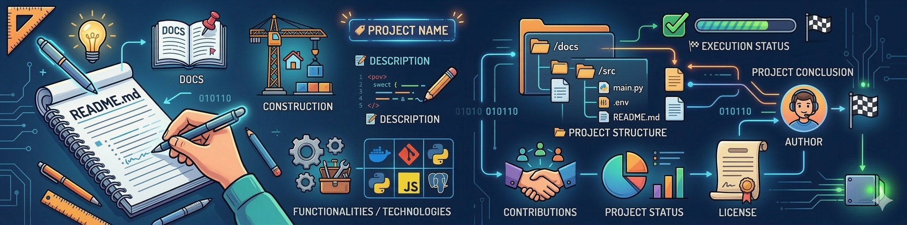

<p align="center">
  
</p>

# 📝 Build Better GitHub Repositories in 2026

[](README_PTBR.md)


# 📝 Guide to Building a Proper GitHub Repository

> 💡 Even in 2026, many people still have questions about how to properly organize a GitHub repository.  
> Having a functional project is important, but presenting it in a clear and organized way can make a huge difference for anyone visiting your profile.

> 📖 With that in mind, I created this guide with some good practices that can help you structure your repositories.  
> By following these tips, your projects will become more organized, professional, and much easier for others to understand.

> **🔥 Tip:** Choose good names for your projects. A clear and catchy name can attract more attention from people who visit your profile for the first time.  
Remember: first impressions matter.

**👋 Hi! My name is Luiz Eduardo. I'm a Software Engineering student and I use this profile to publish academic and personal projects, such as this guide.**

> ✨ The goal of this repository is to help others organize their projects on GitHub by encouraging good practices in documentation, organization, and code presentation.

## 📚 Summary

- 📌 [About the project](#-about-the-project)
- 📖 [What is a README?](#-before-anything-what-is-a-readme)
- ⏳ [Before vs After](#readme-before-and-after)
- 🏗️ [Repository structure](#️---how-to-build-the-structure-of-your-repository)
- 🏷️ [Project name](#️-1--project-name)
- 📝 [Project description](#-2--project-description)
- ⚙️ [Features](#️-3--features)
- 🧰 [Technologies](#-4--technologies-used)
- 📁 [Project structure](#-5--project-structure)
- 🧪 [How to run the project](#-6--how-to-run-your-project)
- ⚙️ [How it works](#️-7--how-the-system-works)
- 🤝 [Contributions](#-8--contributions)
- 📊 [Project status](#-9--project-status)
- 📜 [License](#-10--license)
- 👤 [Author](#-11--author)
- 🏁 [Conclusion](#-conclusion)
- 📌 [README icons](#-icons-to-use-in-your-readme)


## 📌 About

This repository presents a simple and practical guide with good practices for organizing your projects on GitHub.

## 📖 Before anything, what is a README?

> 📌 A README works as the showcase of your project.  
It is where visitors will have their first contact with your work and quickly understand what your repository is about.

### README: Before and After

        ❌ Bad README

            • Title
            • Description
            • How to run

        ✅ Good README 

            • Title
            • Description
            • Summary
            • Features
            • Technologies
            • Structure
            • Execution
            • Operation
            • Guide
            • Contributions
            • License
            • Author

## The Rule of 5 Questions

    1 — What is this project?
    2 — What does it do?
    3 — How can someone run the project?
    4 — How is the code structured?
    5 — How can people contribute to the project?

> 🧭 *If your **README** clearly answers these five questions, it is already fulfilling its role.*

### 🚀 Now let's move on to what really matters

## 🏗️ How to build the structure of your repository?

> In the book *The Pragmatic Programmer*, the authors present an important idea about software development:
> "Programming is more than just writing code. Good developers think about the problem, the design, and the organization of the system even before they start implementing it."
> This means that organization and planning are also part of the development process.

#### **🔗 Reference: Hunt, Andrew; Thomas, David. The Pragmatic Programmer. Addison-Wesley.**

* ⚠️ Important: The goal of this guide is to help you organize and improve the page of a repository — whether you are creating one from scratch or improving an existing one — not to teach how to build a software project from scratch.

---

### 📂 Recommended structure for a repository

## 🏷️ 1 — Project name

> This is the first contact users will have with your project, so it should be clear, intuitive, and easy to remember.
> A good practice is to use simple names in lowercase separated by hyphens, a pattern known as **kebab-case**, which is widely used in the development community.

> Example:
> - software-engineering-projects

## 📝 2 — Project description

        Provide a brief explanation of what the project is and what problem it solves.

> Example:
> - Repository dedicated to publishing projects and activities developed during my Software Engineering degree.

## ⚙️ 3 — Features

        List the functionalities available in the project.

        You can also mention features that will be implemented in the future.

> Example
> - User registration
> - Reservation creation
> - Reservation listing
> - Database integration (under development)

## 🧰 4 — Technologies used

        This section helps visitors quickly understand which tools were used in the development of the project.

> Example
> - C++
> - Git
> - PostgreSQL

## 📁 5 — Project structure

        Here you can show how your project is organized internally.

        This helps other developers quickly understand the architecture of your code.

```
Example:
sistema-autenticacao/
├── src/
│ ├── main.cpp
│ └── utils.cpp
├── docs/
│ └── authentication-guide.md
├── modules/
│ └── authentication/
│ └── authentication.cpp
├── database/
│ └── database.cpp
├── config/
│ └── config.cpp
└── tests/
└── test_main.cpp
```

## 🧪 6 — How to run the project

        Explain in a simple way how anyone can run the project.

        Tip: It is also important to inform the programming language version used.

```
 Example using C++
To compile and run this project, you will need:

- Language: C++ (C++20 standard)
- Compiler: GCC 10+, Clang 10+, or MSVC 19.28+
```
> To run the project in the terminal:
> - git clone <repository-link>
> - g++ main.cpp -o login
> - ./login

## ⚙️ 7 — How the system works

        In this section you can briefly explain how the system works in general.

> Example
> - The system runs through the terminal, where users can authenticate and configure their profile.


## 🤝 8 — Contributions

        If the project is open source, explain how other people can contribute.

```
> Example
> - Contributions are welcome.
> - Feel free to open issues or submit pull requests.

>  You can also recognize people who contributed to the project:
> - [Colleague name] — AI logic
> - [Your name] — project structure and C++
> - [Another contributor] — documentation and tests
```

## 📊 9 — Project status

        Indicate the current stage of the project.

```
> Example:

> 🚧 In development
             ou
>      ✅ Completed
```
## 📜 10 — License

        Here you define how others can use your project.

> Example
> - This project is licensed under the MIT License.

## 👤 11 — Author

        Include your name if you are the main author of the project.

> Example
> - Luiz Eduardo Marchi

<hr style="height:4px;border:none;background-color:gray;">

## ⭐ If this guide was useful to you

If this guide helped you in any way, consider leaving a ⭐ on the repository.  
This helps other people find the project.

## 🏁 Conclusion

> 💡 Organizing a repository well may seem simple, but it can make a big difference in how your work is perceived by others.

> A well-documented project demonstrates organization, attention to detail, and commitment to good development practices. It also makes the code easier to understand, encourages contributions, and makes your portfolio look much more professional.

> By applying these small improvements to your repositories, your projects will not only become easier to understand but will also present a much stronger image of your work as a developer.

> 🧠 Remember: writing code is not enough — knowing how to present and document your project is also an important skill for any developer.

Below are some useful icons that can be used to organize sections in a README.

## 🎨 Icons to use in your README

Icons can help make documentation more visual and easier to navigate.  
Below are some common examples frequently used in README files.

### 📚 General structure

| Icon | Common use | Example |
|------|------|------|
| 📌 | About the project | `## 📌 About the project` |
| 📚 | Summary | `## 📚 Summary` |
| 📖 | Documentation | `## 📖 Documentation` |
| 🧠 | Concepts or explanations | `## 🧠 Concepts` |

### ⚙️ Development

| Icon | Common use | Example |
|------|------|------|
| ⚙️ | System operation | `## ⚙️ How it works` |
| 🧰 | Technologies used | `## 🧰 Technologies` |
| 🏗️ | Project structure | `## 🏗️ Project structure` |
| 🧪 | Tests | `## 🧪 Tests` |

### 🚀 Project execution

| Icon | Common use | Example |
|------|------|------|
| 🚀 | Running the project | `## 🚀 How to run` |
| 💻 | Terminal usage | `## 💻 Usage` |
| 📦 | Installation | `## 📦 Installation` |

### 🤝 Collaboration

| Icon | Common use | Example |
|------|------|------|
| 🤝 | Contributions | `## 🤝 Contributions` |
| 👥 | Contributors | `## 👥 Contributors` |
| 🐛 | Report bugs | `## 🐛 Bugs` |

### 📊 Project information

| Icon | Common use | Example |
|------|------|------|
| 📊 | Project status | `## 📊 Status` |
| 📜 | License | `## 📜 License` |
| 👤 | Author | `## 👤 Author` |
| 🏁 | Conclusion | `## 🏁 Conclusion` |